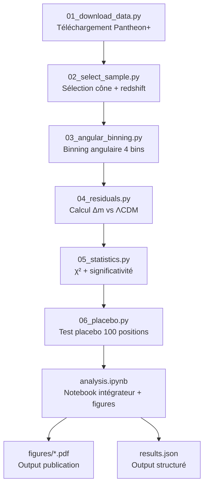

# Architecture technique

## Stack logicielle

| Couche | Outil | Version cible |
|---|---|---|
| Langage | Python | ≥ 3.11 |
| Manipulation de données | pandas, numpy | dernière stable |
| Astronomie | astropy | ≥ 6.0 |
| Cosmologie | astropy.cosmology | inclus |
| Statistiques | scipy.stats, scipy.optimize | dernière stable |
| Bootstrap | numpy.random ou scipy.stats.bootstrap | inclus |
| Cartographie sphérique (optionnel) | healpy | si nécessaire |
| Visualisation | matplotlib, seaborn | dernière stable |
| Notebook intégrateur | Jupyter Lab | dernière stable |
| Reproductibilité | uv (env Python) ou conda | uv préféré |

## Environnement Python — création

```bash
cd /Users/yacinearhalaiss/Workspace/1.KMS/private/projet-revelation/janus-test-observationnel
uv venv .venv
source .venv/bin/activate
uv pip install numpy pandas scipy matplotlib seaborn astropy jupyter healpy
```

Si `uv` non installé : `pip install -r requirements.txt` avec un fichier équivalent.

## Schéma de l'architecture du code



## Détail des modules

### `01_download_data.py`

**Rôle** : télécharger Pantheon+ et vérifier intégrité.

**Input** : aucun
**Output** : fichiers dans `data/pantheon-plus/`
**Dépendances** : `requests`, `hashlib`

```python
# pseudocode
def download(url, target_path, expected_sha256=None):
    """Télécharge un fichier et vérifie son intégrité."""
    ...

URLS = {
    "Pantheon+SH0ES.dat": "https://raw.githubusercontent.com/...",
    "Pantheon+SH0ES_STAT+SYS.cov": "https://raw.githubusercontent.com/...",
}
```

### `02_select_sample.py`

**Rôle** : appliquer les critères de sélection figés dans `01-protocole-pre-enregistre.md`.

**Input** : `data/pantheon-plus/Pantheon+SH0ES.dat`
**Output** : `data/sample_main.csv`, `data/sample_quality_report.txt`

```python
# pseudocode
def select_sample(df):
    """Filtre Pantheon+ selon critères figés du protocole."""
    df = convert_to_galactic(df)
    df['theta_DR'] = angular_distance(df['l_gal'], df['b_gal'], 305.0, 5.0)
    mask = (
        (df['theta_DR'] < 30.0) &
        (df['zCMB'] > 0.05) & (df['zCMB'] < 0.15) &
        (df['m_b_corr_err_DIAG'] < 0.20)
    )
    return df[mask].copy()
```

### `03_angular_binning.py`

**Rôle** : assigner chaque SN à un bin angulaire selon le protocole figé.

```python
BINS = [(0, 5), (5, 12), (12, 20), (20, 30)]  # degrés
```

### `04_residuals.py`

**Rôle** : calculer la magnitude résiduelle de chaque SN par rapport au best-fit ΛCDM (paramètres figés).

```python
from astropy.cosmology import FlatLambdaCDM
cosmo = FlatLambdaCDM(H0=70, Om0=0.3)

def lcdm_distance_modulus(z):
    return cosmo.distmod(z).value

def residual(row):
    return row['m_b_corr'] - (lcdm_distance_modulus(row['zCMB']) + M_B_ABS)
    # M_B_ABS calibrée en utilisant la médiane de l'échantillon hors zone DR
```

### `05_statistics.py`

**Rôle** : χ² par bin, bootstrap pour intervalles de confiance, p-value.

```python
def chi_square_test(bin_residuals, bin_uncertainties):
    """χ² test contre H0: tous les bins ont résiduel moyen = 0."""
    chi2 = np.sum((bin_residuals**2) / (bin_uncertainties**2))
    pvalue = 1 - scipy.stats.chi2.cdf(chi2, df=len(bin_residuals))
    return chi2, pvalue
```

### `06_placebo.py`

**Rôle** : refaire l'analyse complète à 100 positions aléatoires sur le ciel pour calibrer la distribution null.

```python
def placebo_run(df, n_trials=100, seed=42):
    """100 positions aléatoires (excluant DR + plan galactique).
    Retourne distribution des χ² obtenus."""
    rng = np.random.default_rng(seed)
    chi2_distribution = []
    for _ in range(n_trials):
        l_rand = rng.uniform(0, 360)
        b_rand = rng.uniform(-90, 90)
        if abs(b_rand) < 10: continue  # exclut plan galactique
        if angular_distance(l_rand, b_rand, 305, 5) < 40: continue  # exclut zone DR
        # ... refaire l'analyse complète à cette position
        chi2_distribution.append(chi2)
    return np.array(chi2_distribution)
```

### `analysis.ipynb`

**Rôle** : notebook intégrateur qui exécute la pipeline et produit les figures finales.

Cellules attendues :
1. Setup et imports
2. Chargement des données
3. Sélection de l'échantillon (avec sanity check du nombre)
4. Calcul des résiduels
5. Binning angulaire + plot principal (Δm vs θ_DR)
6. Test χ² (résultat numérique)
7. Test placebo (distribution null)
8. Comparaison avec prédiction Janus quantitative (si possible)
9. Figures publiables
10. Export `results.json`

## Conventions de code

- **PEP 8** strict
- **Type hints** sur toutes les fonctions publiques
- **Docstrings NumPy-style** sur tout
- **Tests unitaires** sur les fonctions de calcul (pytest)
- **Random seed fixé** (42) pour reproducibilité du bootstrap et du placebo
- **Logs** : tout résultat numérique loggé en JSON dans `results.json` au fur et à mesure

## Reproductibilité

- `requirements.txt` ou `pyproject.toml` figé
- Commit Git pour chaque étape majeure
- Hash SHA-256 des fichiers de données téléchargés noté dans `data_manifest.json`
- Notebook exécutable de bout en bout sans intervention manuelle

## Estimation du temps de calcul

| Étape | Temps estimé |
|---|---|
| Téléchargement | ~30 s |
| Sélection sample | < 1 s |
| Binning + résiduels | < 1 s |
| χ² test | < 1 s |
| **Test placebo (100 trials)** | **~2-5 min** (étape la plus longue) |
| Figures | ~10 s |
| **Total bout-en-bout** | **< 10 min** |

→ Tout faisable sur un MacBook standard, pas besoin de cluster.

## Versioning

```
v0.1 — protocole figé, code structure
v0.2 — données téléchargées, sample sélectionné
v0.3 — résiduels calculés, premier plot
v0.4 — test placebo terminé
v1.0 — notebook complet, figures publiables, results.json final
```

## Output structuré (`results.json`)

```json
{
  "protocol_version": "1.0",
  "git_commit_freeze": "...",
  "execution_date": "...",
  "sample": {
    "n_total_pantheon": 1701,
    "n_after_selection": 67,
    "n_per_bin": [12, 18, 22, 15]
  },
  "residuals": {
    "bin_0_mean": 0.012,
    "bin_0_err": 0.044,
    "bin_1_mean": 0.085,
    "bin_1_err": 0.035,
    ...
  },
  "test_main": {
    "chi2": 8.34,
    "df": 4,
    "pvalue": 0.080,
    "verdict": "non_discriminant"
  },
  "test_placebo": {
    "n_trials": 100,
    "rank_DR": 23,
    "percentile": 77,
    "verdict": "consistent_with_null"
  },
  "test_robustness": {
    "bins_minus_20pct": "stable",
    "bins_plus_20pct": "stable"
  }
}
```
