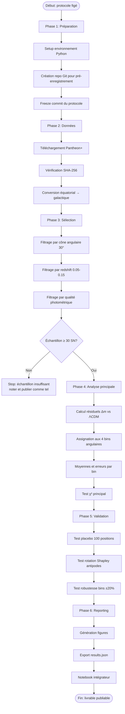
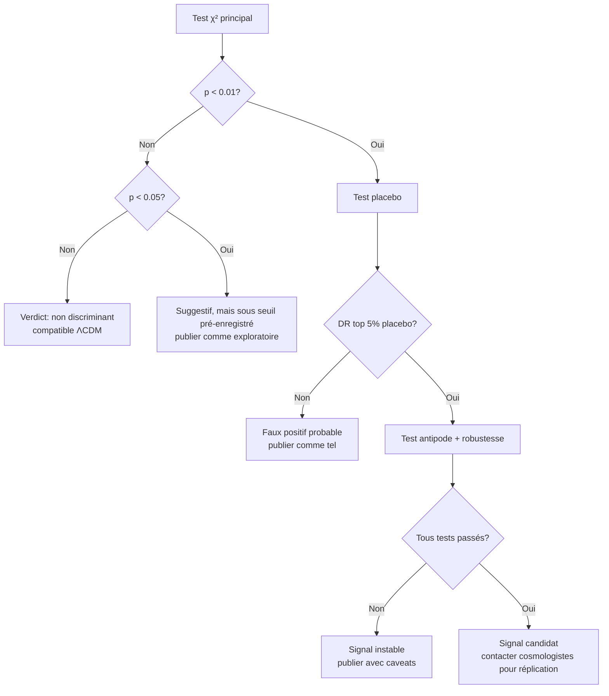

# Pipeline d'analyse — étapes détaillées

## Vue d'ensemble (Mermaid)



## Phase 1 — Préparation (~30 min)

### 1.1 Setup environnement

```bash
cd /Users/yacinearhalaiss/Workspace/1.KMS/private/projet-revelation/janus-test-observationnel

# Python env
uv venv .venv
source .venv/bin/activate
uv pip install numpy pandas scipy matplotlib seaborn astropy jupyter healpy

# Vérification
python -c "import astropy, numpy, pandas, scipy; print('OK')"
```

### 1.2 Pré-enregistrement public

**Important** : le pré-enregistrement doit être **vérifiable publiquement** pour avoir une valeur scientifique.

Options par ordre de rigueur :

| Option | Coût | Vérifiabilité |
|---|---|---|
| OSF (Open Science Framework) | gratuit | timestamp public + DOI |
| Zenodo | gratuit | DOI permanent |
| arXiv (avec section "pre-registered protocol") | gratuit | pas idéal pour un protocole |
| Repo GitHub public dédié | gratuit | timestamp Git + tag signé |

**Recommandation** : OSF + miroir GitHub public. Coût ~15 min de setup.

### 1.3 Freeze du protocole

```bash
# Une fois OSF et/ou GitHub configurés
git add 01-protocole-pre-enregistre.md
git commit -m "freeze: pre-registered protocol v1.0"
git tag v1.0-protocol-frozen
# Si GitHub public: git push --tags
```

**Noter le hash de commit** dans le frontmatter de `01-protocole-pre-enregistre.md`.

## Phase 2 — Acquisition des données (~5 min)

### 2.1 Téléchargement

```bash
cd data/pantheon-plus
curl -L -o "Pantheon+SH0ES.dat" \
  "https://raw.githubusercontent.com/PantheonPlusSH0ES/DataRelease/main/Pantheon+_Data/4_DISTANCES_AND_COVAR/Pantheon%2BSH0ES.dat"
```

### 2.2 Vérification d'intégrité

```python
import hashlib
def file_sha256(path):
    h = hashlib.sha256()
    with open(path, 'rb') as f:
        for chunk in iter(lambda: f.read(8192), b''):
            h.update(chunk)
    return h.hexdigest()

manifest = {
    "Pantheon+SH0ES.dat": file_sha256("data/pantheon-plus/Pantheon+SH0ES.dat"),
    # ...
}
```

Sauvegarder dans `data_manifest.json` — figé pour reproductibilité.

### 2.3 Conversion en coordonnées galactiques

```python
import pandas as pd
from astropy.coordinates import SkyCoord
import astropy.units as u

df = pd.read_csv("data/pantheon-plus/Pantheon+SH0ES.dat", sep=r'\s+', comment='#')

c = SkyCoord(ra=df['RA'].values*u.deg, dec=df['DEC'].values*u.deg, frame='icrs')
df['l_gal'] = c.galactic.l.deg
df['b_gal'] = c.galactic.b.deg
```

## Phase 3 — Sélection de l'échantillon (~5 min)

### 3.1 Calcul de la distance angulaire au Dipole Repeller

```python
import numpy as np

L_DR, B_DR = 305.0, 5.0  # figé par protocole

def angular_distance_deg(l1, b1, l2, b2):
    """Loi des cosinus sphériques."""
    l1, b1, l2, b2 = np.deg2rad([l1, b1, l2, b2])
    cos_d = np.sin(b1)*np.sin(b2) + np.cos(b1)*np.cos(b2)*np.cos(l1-l2)
    return np.rad2deg(np.arccos(np.clip(cos_d, -1, 1)))

df['theta_DR'] = angular_distance_deg(df['l_gal'], df['b_gal'], L_DR, B_DR)
```

### 3.2 Application des filtres figés

```python
mask = (
    (df['theta_DR'] < 30.0) &
    (df['zCMB'] > 0.05) & (df['zCMB'] < 0.15) &
    (df['m_b_corr_err_DIAG'] < 0.20)
)
sample = df[mask].copy()

print(f"Échantillon principal: {len(sample)} SN-Ia")
```

### 3.3 Sanity checks

- Vérifier qu'on a au moins 30 SN au total
- Au moins 5 SN par bin angulaire
- Pas de cluster anormal en redshift
- Pas de biais survey (un seul survey domine ?)

→ Si l'un de ces checks échoue, **noter et continuer**, mais le résultat sera flagué comme limite.

## Phase 4 — Analyse principale (~5 min)

### 4.1 Calcul des résiduels

```python
from astropy.cosmology import FlatLambdaCDM
cosmo = FlatLambdaCDM(H0=70, Om0=0.3)

# Magnitude absolue calibrée sur le reste de Pantheon+ (HORS échantillon DR)
control = df[df['theta_DR'] >= 40].copy()  # contrôle: hors zone DR + bordure
control['mu_lcdm'] = cosmo.distmod(control['zCMB']).value
M_B_ABS = (control['m_b_corr'] - control['mu_lcdm']).median()

# Résiduels
sample['mu_lcdm'] = cosmo.distmod(sample['zCMB']).value
sample['delta_m'] = sample['m_b_corr'] - sample['mu_lcdm'] - M_B_ABS
```

### 4.2 Binning angulaire et stats

```python
BINS_DEG = [(0, 5), (5, 12), (12, 20), (20, 30)]

results = []
for i, (lo, hi) in enumerate(BINS_DEG):
    mask = (sample['theta_DR'] >= lo) & (sample['theta_DR'] < hi)
    sub = sample[mask]
    n = len(sub)
    mean = sub['delta_m'].mean()
    err = sub['delta_m'].std() / np.sqrt(n) if n > 1 else np.nan
    results.append({"bin": i, "theta_range": (lo, hi), "n": n, "mean": mean, "err": err})
```

### 4.3 Test χ² principal

```python
chi2 = sum((r['mean']**2 / r['err']**2) for r in results if r['n'] > 1)
import scipy.stats
df_stat = sum(1 for r in results if r['n'] > 1)
pvalue = 1 - scipy.stats.chi2.cdf(chi2, df=df_stat)

print(f"χ² = {chi2:.2f}, df = {df_stat}, p = {pvalue:.4f}")
```

### 4.4 Décision préliminaire

| Résultat χ² | Interprétation |
|---|---|
| p > 0.05 | non rejet H0 — compatible ΛCDM |
| 0.01 < p < 0.05 | suggestif, à vérifier au placebo |
| p < 0.01 | signal statistiquement significatif, doit passer placebo |

## Phase 5 — Tests de validation (~10 min)

### 5.1 Test placebo (100 trials)

```python
from copy import deepcopy

rng = np.random.default_rng(seed=42)
placebo_chi2 = []

for trial in range(100):
    while True:
        l_rand = rng.uniform(0, 360)
        b_rand = rng.uniform(-90, 90)
        # Exclusions: plan galactique et zone DR
        if abs(b_rand) < 10: continue
        if angular_distance_deg(l_rand, b_rand, 305, 5) < 40: continue
        break
    
    # Recalculer theta autour de cette position aléatoire
    df['theta_rand'] = angular_distance_deg(df['l_gal'], df['b_gal'], l_rand, b_rand)
    mask_rand = (df['theta_rand'] < 30) & (df['zCMB'] > 0.05) & (df['zCMB'] < 0.15) & (df['m_b_corr_err_DIAG'] < 0.20)
    sample_rand = df[mask_rand].copy()
    if len(sample_rand) < 20: continue  # skip if too few
    
    # Calcul résiduels et χ²
    sample_rand['mu_lcdm'] = cosmo.distmod(sample_rand['zCMB']).value
    sample_rand['delta_m'] = sample_rand['m_b_corr'] - sample_rand['mu_lcdm'] - M_B_ABS
    
    chi2_trial = 0
    for lo, hi in BINS_DEG:
        m = (sample_rand['theta_rand'] >= lo) & (sample_rand['theta_rand'] < hi)
        sub = sample_rand[m]
        if len(sub) > 1:
            chi2_trial += (sub['delta_m'].mean()**2) / (sub['delta_m'].std() / np.sqrt(len(sub)))**2
    
    placebo_chi2.append(chi2_trial)

# Quantile du χ² du DR dans la distribution placebo
percentile_DR = np.mean(np.array(placebo_chi2) > chi2)
print(f"χ² du DR dans le top {percentile_DR*100:.1f}% du placebo")
```

**Critère figé** : pour considérer le signal comme réel, il faut que $\chi^2_{DR}$ soit dans le top 5% du placebo (`percentile_DR < 0.05`).

### 5.2 Test rotation antipode

Refaire l'analyse à $(l, b) = (305 + 180, -5) \mod 360$ (antipodes du DR, vers le Shapley Attractor). Sous Janus, on attendrait un signal de signe **opposé** (excès de luminosité au lieu d'atténuation).

### 5.3 Test robustesse des bins

Refaire avec :
- Bins ±20% : `[(0, 4), (4, 14), (14, 24), (24, 30)]`
- Bins ±20% inverse : `[(0, 6), (6, 10), (10, 16), (16, 30)]`

Si le résultat change qualitativement, le signal est instable → flag dans le report.

## Phase 6 — Reporting (~30 min)

### 6.1 Figures à produire

| Figure | Contenu |
|---|---|
| `01_skymap.pdf` | Position du DR + SN candidates sur projection Mollweide |
| `02_residuals_vs_theta.pdf` | Δm vs θ_DR par bin, avec errbars + prédiction Janus si quantifiable |
| `03_placebo_distribution.pdf` | Histogramme des χ² placebo + flèche pour DR |
| `04_robustness.pdf` | Comparaison résultat selon bins ±20% |

### 6.2 Notebook intégrateur

`code/analysis.ipynb` qui exécute toute la pipeline et produit toutes les figures + `results.json`.

### 6.3 Document de résultats

Format : `RESULTS.md` à la racine du dossier, avec :
- Résumé en 3 lignes
- Tableau des résultats numériques
- Figures intégrées
- Décision finale (selon les seuils figés)
- Limitations honnêtes

## Diagramme de décision (Mermaid)



## Estimation totale du temps de Phase 1 → Phase 6

| Phase | Durée | Cumul |
|---|---|---|
| 1. Préparation | 30 min | 30 min |
| 2. Données | 5 min | 35 min |
| 3. Sélection | 5 min | 40 min |
| 4. Analyse principale | 5 min | 45 min |
| 5. Validation | 10 min | 55 min |
| 6. Reporting | 30 min | 85 min |

**~1h30 pour une exécution complète, en supposant que tout marche du premier coup.**

Avec debug et itération réaliste : compter **3-5h de travail effectif**.
