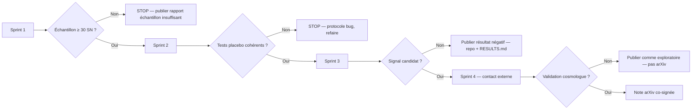

# Livrables et roadmap d'exécution

## Livrables cibles (par ordre d'ambition)

### Niveau 1 — Notebook reproductible (minimum viable)

- `code/analysis.ipynb` exécutable de bout en bout
- `data_manifest.json` avec hashes
- `results.json` avec verdicts numériques
- 4 figures PDF
- `RESULTS.md` synthétisant la conclusion

**Public visé** : nous-mêmes, vérification interne, base pour suite.

### Niveau 2 — Repo public partageable

- Repo GitHub public (séparé du KMS, sous license MIT ou CC-BY)
- README clair avec contexte (controverse Janus) et résultats
- Notebook avec mybinder.org pour exécution en ligne
- Pré-enregistrement OSF lié

**Public visé** : cosmologistes (Pomarède, Courtois, Riess team), journalistes scientifiques, communauté Petit.

### Niveau 3 — Note arXiv (si signal candidat)

Format note courte (4-6 pages) :
- Title : *Empirical test of the Janus cosmological model's prediction of annular attenuation behind the Dipole Repeller*
- Sections : intro très courte sur la prédiction, méthodologie pré-enregistrée, résultats, limitations, appel à réplication
- Section : "Authors and acknowledgments" — citer Pomarède/Courtois pour validation préalable si on les a contactés

**Public visé** : communauté académique en cosmologie. Soumission arXiv.cosmology dans la catégorie "physics.gen-ph" ou "astro-ph.CO".

⚠️ Le niveau 3 ne doit être tenté **qu'avec** une co-signature ou validation par un cosmologiste académique. Sinon le papier sera ignoré quel que soit son contenu.

## Roadmap réaliste

### Sprint 1 (2-3h, faisable ce week-end ou un soir)

```mermaid
gantt
    title Sprint 1 — Préparation et données
    dateFormat HH:mm
    axisFormat %H:%M
    section Phase 1
    Setup env Python           :a1, 00:00, 30m
    Création repo Git public    :a2, after a1, 30m
    Freeze protocole pré-enreg  :a3, after a2, 15m
    section Phase 2
    Téléchargement Pantheon+    :b1, after a3, 5m
    Vérif intégrité + manifest  :b2, after b1, 10m
    Conversion gal coords       :b3, after b2, 15m
    section Phase 3
    Sélection sample            :c1, after b3, 15m
    Sanity checks               :c2, after c1, 15m
```



**Output sprint 1** : échantillon sélectionné, sanity checks passés ou échec documenté.

**Décision après sprint 1** : si l'échantillon a < 30 SN, **arrêter** et publier comme tel (ce qui en soi est un livrable).

### Sprint 2 (2-3h)

```mermaid
gantt
    title Sprint 2 — Analyse et validation
    dateFormat HH:mm
    axisFormat %H:%M
    section Phase 4
    Calcul résiduels            :d1, 00:00, 15m
    Binning + stats              :d2, after d1, 15m
    Test χ² principal            :d3, after d2, 15m
    section Phase 5
    Test placebo 100 trials      :e1, after d3, 30m
    Test antipode                :e2, after e1, 15m
    Test robustesse              :e3, after e2, 15m
```



**Output sprint 2** : tous les tests effectués, verdict stable.

### Sprint 3 (2-3h)

```mermaid
gantt
    title Sprint 3 — Reporting
    dateFormat HH:mm
    axisFormat %H:%M
    Génération figures           :f1, 00:00, 60m
    Notebook propre              :f2, after f1, 45m
    RESULTS.md                  :f3, after f2, 30m
    Push GitHub + OSF            :f4, after f3, 15m
```



**Output sprint 3** : repo public propre, partageable.

### Sprint 4 (optionnel, 2-5j si signal candidat)

- Contact Pomarède + Courtois pour validation
- Si validation positive → préparer note arXiv co-signée
- Si validation critique → réviser ou abandonner
- Diffusion : courrier à Petit, à Damour (transparence), à La Recherche

## Templates de communications

### Email à Daniel Pomarède (CEA Saclay)

```
Sujet : Test observationnel de la prédiction de Petit-Margnat-Zejli (EPJ-C 2024) 
        sur le Dipole Repeller — demande de validation méthodologique

Bonjour M. Pomarède,

Je suis [profil bref]. Je m'intéresse à la controverse récente autour du modèle 
Janus de J.-P. Petit, et notamment à la prédiction discriminante formulée dans 
Petit, Margnat, Zejli 2024 (EPJ-C 84:1226) : un effet d'atténuation annulaire 
de la luminosité des sources situées derrière le Dipole Repeller, dû à une 
lentille gravitationnelle inversée par la sous-densité.

J'ai conçu un protocole d'analyse pré-enregistré (lien OSF: ...) utilisant 
les données publiques Pantheon+ pour tester cette prédiction. L'échantillon 
attendu est ~50-100 SN-Ia derrière le DR.

Avant d'exécuter l'analyse, je serais reconnaissant pour votre avis sur :

1. La pertinence des coordonnées choisies pour le DR (l=305°, b=+5°, basé sur 
   votre article 2017 — y a-t-il une mise à jour CF4 que je devrais utiliser ?)

2. La validité méthodologique du test (cône angulaire 30°, bins concentriques, 
   redshifts 0.05-0.15)

3. Toute mise en garde que vous identifieriez sur ce test particulier

Je suis conscient que la prédiction est marginale et que le résultat le plus 
probable est non-discriminant — mais l'absence de test publié à ce jour 
me semble être un manque qu'on peut combler proprement.

Le protocole et le code seront entièrement publiés (GitHub + OSF), quel que 
soit le résultat.

Très cordialement,
[Yacine]
```

## Risques et seuils d'arrêt



## Conditions de succès

| Niveau | Critère |
|---|---|
| **Succès minimum** | Notebook exécutable + résultat publiable même négatif |
| **Succès intermédiaire** | Repo public propre + diffusion à 5+ chercheurs |
| **Succès maximum** | Note arXiv co-signée + reprise par communauté |

**Le succès minimum est garanti à 95% si on suit le protocole.** Les autres niveaux dépendent de facteurs externes (réceptivité de la communauté, signal réel ou non).

## Coût total estimé

| Item | Coût |
|---|---|
| Temps personnel (3 sprints × 3h) | ~10 h |
| Compute | 0 (laptop) |
| Software | 0 (open source) |
| Hébergement OSF/GitHub | 0 (gratuit) |
| **Total monétaire** | **0 €** |
| **Total temps** | **~10 h** |

## Décision à prendre

Avant de démarrer Sprint 1 :

- [ ] Yacine valide le protocole figé `01-protocole-pre-enregistre.md`
- [ ] Décision sur la publication GitHub : repo public ou privé en phase 1 ?
- [ ] Décision sur OSF : oui ou non pour le pré-enregistrement formel ?
- [ ] Disposition à contacter Pomarède en sprint 4 (si signal) ?

## Ce qu'il faudrait faire si l'analyse n'est pas portée à terme

Si on s'arrête après Sprint 1 ou 2, **publier quand même** :
- Le protocole (montre qu'on a essayé)
- Le code partiel
- Une note "to be continued" claire

Cela vaut mieux qu'un travail privé qui se perd. La transparence sur les essais incomplets est elle-même une contribution à la science ouverte.
