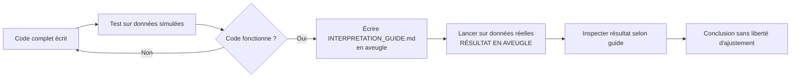

# Pièges méthodologiques et biais

## Les 7 pièges classiques à éviter

### 1. Cherry-picking (le pire)

**Risque** : modifier les bins, le cône angulaire, ou la plage de redshift après avoir vu les données pour "faire apparaître" un signal.

**Garde-fou** : pré-enregistrement formel du protocole avec timestamp public (Git tag + OSF), refus absolu de modifier après accès aux données. Toute modification post-data doit être étiquetée "exploratoire", pas "test pré-enregistré".

### 2. p-hacking par essais multiples

**Risque** : essayer 20 versions du test, garder celle qui donne $p < 0.05$, prétendre que c'était le test prévu.

**Garde-fou** : un **seul** test principal pré-enregistré. Les variations de robustesse sont déclarées comme telles, et leur p-value n'est PAS interprétée comme primaire.

### 3. Optional stopping

**Risque** : exécuter le test, voir un résultat non concluant, ajouter des SN supplémentaires (en élargissant le cône, par exemple), refaire le test, répéter jusqu'à $p < 0.05$.

**Garde-fou** : un seul run principal sur l'échantillon défini par le protocole. Les variations sont des tests de robustesse, pas des relances pour atteindre la significativité.

### 4. HARKing (Hypothesizing After Results are Known)

**Risque** : "Le signal annulaire n'est pas là, mais regardez ce signal en quadrant ! C'est ce que Janus prédisait en fait !"

**Garde-fou** : la prédiction Janus testée est figée dans le pré-enregistrement et c'est **uniquement celle-ci** qui constitue le test principal. Toute autre observation est exploratoire et doit être notée comme telle.

### 5. Confirmation bias

**Risque** : interpréter favorablement chaque ambiguïté en faveur de l'hypothèse qu'on espère valider (Janus ou ΛCDM selon notre biais).

**Garde-fou** : faire le test placebo en aveugle (sans regarder le résultat DR avant), puis comparer. Si possible, faire l'analyse à deux personnes en parallèle et comparer les conclusions.

### 6. Sélection de l'échantillon corrélée à l'effet

**Risque** : appliquer un seuil de qualité photométrique différent selon la zone du ciel, créant artificiellement un signal.

**Garde-fou** : critères de qualité **identiques** dans le sample principal, le placebo, et le contrôle. Toujours.

### 7. Validation par exemples favorables

**Risque** : "Le placebo donne $\chi^2 < \chi^2_{DR}$ dans 4% des trials. Donc le DR est significatif." Mais si on refait le placebo avec un seed différent et qu'on tombe à 8%, on l'oublie.

**Garde-fou** : seed fixé dans le protocole. Un seul tirage placebo. Si on veut vérifier la stabilité, lancer 10 tirages avec 10 seeds différents et reporter les **dix**, pas le plus favorable.

## Biais à déclarer dans le rapport final

### Biais subjectifs

À déclarer explicitement dans `RESULTS.md` :

> **Disclosure** : Cette analyse a été conçue par [Yacine Arhaliass + assistant Claude] dans le cadre d'un intérêt initial pour la controverse Petit-Damour. L'auteur principal n'est pas un physicien académique. Le protocole a été pré-enregistré le [date] avec hash de commit [hash] sur OSF [URL]. Aucune correction post-data n'a été apportée au protocole. L'auteur n'a pas d'affiliation institutionnelle au domaine cosmologique et n'a pas reçu de financement pour ce travail.

### Biais structurels du test

Liste honnête des biais qu'on **ne peut pas** éliminer :

1. **Bruit intrinsèque des SN-Ia** (~0.15 mag) limite la sensibilité. Si la prédiction Janus est < 0.1 mag d'amplitude, le test est de toute façon limite-discriminant.

2. **Localisation du DR imprécise** : Hoffman 2017 donne une position avec incertitude ~5°. La prédiction quantitative dépend du modèle exact de la sous-densité, qui n'est pas fixé par Janus seul mais par les données CF4. Une mauvaise localisation → faux négatif.

3. **Modèle quantitatif Janus partiel** : on teste une prédiction qualitative (anneau vs disque), pas la forme exacte de l'anneau. Un test plus fort exigerait de calculer la prédiction quantitative de Janus pour la géométrie spécifique du DR — ce qui demanderait de redériver les équations de Petit-Zejli pour ce cas particulier. Hors scope phase 1.

4. **Effets concomitants** : la zone galactique entre nous et le DR contient d'autres structures (Local Void, Shapley Attractor en arrière-plan, etc.) qui peuvent créer du bruit cosmologique non gaussien. Ce n'est pas du bruit blanc.

5. **Sélection Pantheon+** : la couverture du ciel n'est pas uniforme. Certaines zones sont mieux échantillonnées. Le DR pourrait tomber dans une zone moins favorable.

### Biais d'interprétation

À noter dans la conclusion :

> Un résultat compatible avec l'hypothèse nulle ΛCDM **n'invalide pas** Janus (le signal pourrait être en dessous de notre seuil de détection). Un signal annulaire significatif **n'établit pas** Janus (d'autres explications sont possibles : effets de sélection Pantheon+, structures intermédiaires, fluctuations statistiques). Ce test est **discriminant en un sens** (ΛCDM ne prédit pas de signal annulaire) **mais pas en l'autre** (Janus n'est pas la seule théorie qui en prédirait un).

## Procédure de blind analysis (recommandée mais optionnelle)

Pour un test vraiment rigoureux :

L'idée : écrire le guide d'interprétation **avant** de voir le résultat, pour ne pas pouvoir adapter l'interprétation au résultat.

## Engagements de transparence

Engagements pris **avant** l'analyse :

1. ✅ Publication du protocole **avant** accès aux données
2. ✅ Code complet en open source
3. ✅ Données et hashes archivés
4. ✅ Tous les tests faits, y compris ceux non concluants
5. ✅ Distribution placebo entièrement publiée (pas juste le DR)
6. ✅ Auteur disponible pour répondre aux questions méthodologiques
7. ✅ Résultats négatifs publiés au même titre que les positifs

## Que faire si on découvre un bug après publication ?

Politique : transparente.
1. Noter le bug dans le repo (issue + commit fix)
2. Refaire l'analyse complète
3. Publier une **erratum note** comparant avant/après
4. Ne pas masquer l'erreur, ne pas modifier silencieusement la version originale

## Conformité avec les standards de pré-enregistrement

Standards à respecter :
- **OSF Pre-Registration Challenge** template
- **AsPredicted.org** style si plus simple
- **Cosmology Best Practices** (e.g., GAMBIT collaboration)

Lien à inclure : ce qui est pré-enregistré vs ce qui est exploratoire doit être **visuellement distingué** dans le rapport final.

## Auto-évaluation finale

Avant de publier, répondre honnêtement :

- [ ] Aurais-je accepté ce résultat s'il avait été inverse ?
- [ ] Ai-je modifié le protocole après avoir vu les données ?
- [ ] Ai-je essayé d'autres bins/cônes/redshifts qui ne sont pas dans le rapport ?
- [ ] Ai-je rapporté tous les tests, y compris ceux qui ne supportent pas ma conclusion ?
- [ ] Mon co-auteur (ou un sceptique imaginaire) approuverait-il cette analyse ?

Si une réponse est "non" ou "je ne sais pas", **revoir avant publication**.
