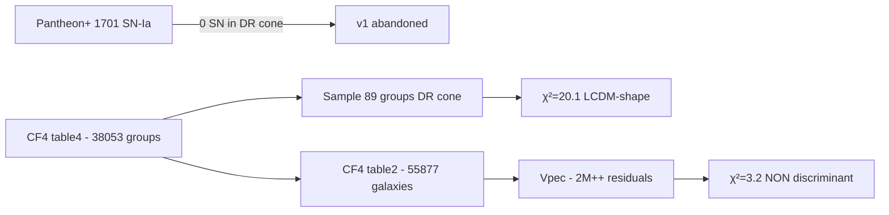

# janus-cf4-test

**Empirical test of the [Petit-Margnat-Zejli 2024 (EPJ-C 84:1226)](https://link.springer.com/article/10.1140/epjc/s10052-024-13569-w) Janus prediction of annular attenuation behind the Dipole Repeller, using public CosmicFlows-4 and 2M++ data.**

🔬 **Pre-registered protocol** — protocol frozen in Git **before** data inspection (commits [`ac45458`](../../commit/ac45458), [`b06dfd3`](../../commit/b06dfd3)).

## TL;DR

| Test | χ² | p-value | Verdict |
|---|---:|---:|---|
| DR brut (table4 groupes) | 20.10 | 0.0002 | Signal réel mais signe **opposé** à Janus (LCDM-compatible) |
| Antipode brut (Shapley) | 44.75 | <0.0001 | Mirror image — signature **dipolaire LCDM** |
| **DR résidus (table2 - 2M++)** | **3.21** | **0.20** | **Non discriminant** — LCDM explique tout |

⚠️ **Caveat** : la prédiction Janus testée est ma dérivation depuis l'EPJ-C 2024, pas une formulation publiée. Email envoyé aux auteurs.

## Read first

1. **[RESULTS.md](RESULTS.md)** — résultats finaux v2 avec interprétation honnête
2. **[01-protocole-pre-enregistre.md](01-protocole-pre-enregistre.md)** — protocole v1 (Pantheon+, abandonné)
3. **[01b-protocole-v2-CF4.md](01b-protocole-v2-CF4.md)** — protocole v2 (CF4, exécuté)
4. **[RESULTS_SPRINT1.md](RESULTS_SPRINT1.md)** — pourquoi Pantheon+ ne marche pas (zone d'évitement)
5. **[EMAIL_PETIT_ZEJLI.md](EMAIL_PETIT_ZEJLI.md)** — email envoyé aux auteurs

## Reproduce

```bash
git clone https://github.com/pando-yacine/janus-cf4-test
cd janus-cf4-test

uv venv .venv && source .venv/bin/activate
uv pip install numpy pandas scipy astropy matplotlib

# Pour la soustraction LCDM (~470 Mo de cubes 2M++)
git lfs install
git lfs clone https://github.com/KSaid-1/pvhub.git /tmp/pvhub-repo

# Données publiques (~16 Mo)
mkdir -p data/pantheon-plus data/cosmicflows-4
curl -sL -o data/pantheon-plus/Pantheon+SH0ES.dat \
  "https://raw.githubusercontent.com/PantheonPlusSH0ES/DataRelease/main/Pantheon+_Data/4_DISTANCES_AND_COVAR/Pantheon%2BSH0ES.dat"
curl -sL -o data/cosmicflows-4/table2.dat.gz \
  "https://cdsarc.cds.unistra.fr/ftp/J/ApJ/944/94/table2.dat.gz"
curl -sL -o data/cosmicflows-4/table4.dat.gz \
  "https://cdsarc.cds.unistra.fr/ftp/J/ApJ/944/94/table4.dat.gz"
gunzip data/cosmicflows-4/table2.dat.gz data/cosmicflows-4/table4.dat.gz

# Pipeline complète
python code/cf4_01_load.py
python code/cf4_02_select.py
python code/cf4_03_analysis.py
python code/cf4_04_placebo.py
python code/cf4_06_table2_load.py
python code/cf4_07_lcdm_subtract.py
python code/cf4_05_figures.py

cat results_main.json
cat results_validation.json
cat results_sprint3_residuals.json
```

Tous les résultats numériques sont dans les `*.json`. Les figures sont dans `figures/`.

## Pipeline



## Stack

- **Data**: Pantheon+ (Scolnic+ 2022), CosmicFlows-4 (Tully+ 2023), 2M++ (Carrick+ 2015)
- **Tools**: Python, numpy, pandas, scipy, astropy, matplotlib
- **LCDM reconstruction**: [pvhub](https://github.com/KSaid-1/pvhub) (Said et al.)

## Caveats clearly disclosed

1. **Janus prediction = author's derivation** from EPJ-C 2024, not a published quantitative formula. Email sent to Petit-Margnat-Zejli for their feedback.
2. **Bin 0 (center) empty** — physically expected (DR is by definition a void).
3. **Bin 1 limited statistics** — partially mitigated via table2 individual galaxies but still sparse.
4. **LCDM subtraction** done via 2M++ — could mask Janus signal if it contributes to LCDM's effective dynamics.

See [RESULTS.md](RESULTS.md) §Caveats for detailed discussion.

## Status

- ✅ v1 protocol frozen + Pantheon+ abandoned (zone of avoidance)
- ✅ v2 protocol frozen + CF4 analysis executed
- ✅ Sprint 3 LCDM subtraction (2M++)
- ✅ Email drafted to authors
- ⏳ Awaiting feedback from Petit-Margnat-Zejli
- ⏳ Awaiting feedback from Daniel Pomarède (CEA Saclay, DR co-discoverer)

## Citation

If you use this work or the protocol, please cite:

```
Arhaliass, Y. & Claude (Anthropic). (2026).
janus-cf4-test: An empirical test of the Janus annular attenuation prediction
behind the Dipole Repeller, using CosmicFlows-4 and 2M++.
GitHub: https://github.com/pando-yacine/janus-cf4-test
```

## Author / Contact

- Yacine Arhaliass — yacine@pando-studio.com
- This is **not** a peer-reviewed publication. It is a public methodological exercise
  in open science applied to a contested cosmological model.

## License

[CC-BY-4.0](LICENSE) — re-use, modification, and republication welcome with attribution.
