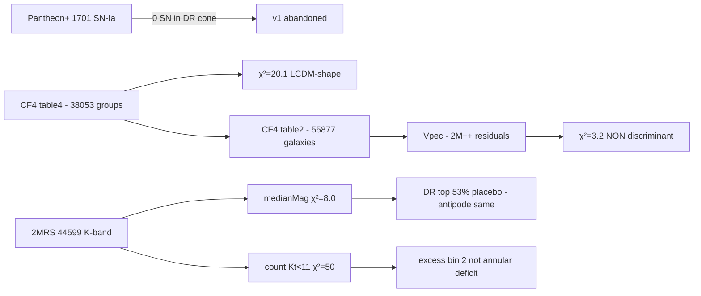

# janus-cf4-test

**Empirical, pre-registered test of the [Petit-Margnat-Zejli 2024 (EPJ-C 84:1226)](https://link.springer.com/article/10.1140/epjc/s10052-024-13569-w) Janus prediction of annular attenuation behind the Dipole Repeller.**

Three datasets, in series:
1. **Pantheon+** (1701 SN-Ia) — abandonné (DR dans zone d'évitement)
2. **CosmicFlows-4** (Vpec brut + résidus post-LCDM via 2M++)
3. **2MRS** (44 599 galaxies K-band — test photométrique direct, aligné mot-à-mot avec la prédiction publiée)

🔬 **Pre-registered protocol** — protocol frozen in Git **before** data inspection (commits [`ac45458`](../../commit/ac45458), [`b06dfd3`](../../commit/b06dfd3), [`bcdc0e1`](../../commit/bcdc0e1)).

## TL;DR

| Sprint | Test | χ² | Verdict |
|---|---|---:|---|
| 1 (Pantheon+) | impossible — 0 SN dans cône DR | — | abandonné (zone d'évitement) |
| 2 (CF4 brut) | Vpec DR vs ctrl | 20.10 | LCDM-compatible (forme dipolaire DR-Shapley) |
| 3 (CF4 résidus 2M++) | Vpec - Vpec_LCDM | 3.21 | non discriminant |
| **4 (2MRS — le « bon » test)** | médiane $M_K^{app}$ par bin | **8.05** | **non discriminant** (DR top 53% du placebo) |
| **4 (2MRS bis)** | comptage $K_t < 11$ par bin | 50.36 | non spécifique au DR (excès au lieu de déficit annulaire) |

**Conclusion principale** : le test photométrique direct sur 2MRS — celui qui correspond textuellement à la prédiction publiée par Petit & Zejli — **ne révèle aucune signature annulaire spécifique au Dipole Repeller**. L'antipode (Shapley) reproduit le même pattern → artefact spatial, pas signature DR.

⚠️ **Caveat permanent** : la quantification numérique précise reliant la prédiction d'« atténuation annulaire » à une amplitude observable reste **ma dérivation**, pas une formule explicite des auteurs. Email envoyé pour validation.

## Read first

1. **[RESULTS.md](RESULTS.md)** — résultats finaux v3 avec interprétation honnête
2. **[01-protocole-pre-enregistre.md](01-protocole-pre-enregistre.md)** — protocole v1 (Pantheon+, abandonné)
3. **[01b-protocole-v2-CF4.md](01b-protocole-v2-CF4.md)** — protocole v2 (CF4)
4. **[01c-protocole-v3-2MRS.md](01c-protocole-v3-2MRS.md)** — protocole v3 (2MRS — test photométrique direct)
5. **[EMAIL_PETIT_ZEJLI.md](EMAIL_PETIT_ZEJLI.md)** — email envoyé aux auteurs

## Reproduce

```bash
git clone https://github.com/pando-yacine/janus-cf4-test
cd janus-cf4-test

uv venv .venv && source .venv/bin/activate
uv pip install numpy pandas scipy astropy matplotlib

# Pour la soustraction LCDM (~470 Mo de cubes 2M++)
git lfs install
git lfs clone https://github.com/KSaid-1/pvhub.git /tmp/pvhub-repo

# Données publiques
mkdir -p data/pantheon-plus data/cosmicflows-4 data/2mrs
curl -sL -o data/pantheon-plus/Pantheon+SH0ES.dat \
  "https://raw.githubusercontent.com/PantheonPlusSH0ES/DataRelease/main/Pantheon+_Data/4_DISTANCES_AND_COVAR/Pantheon%2BSH0ES.dat"
curl -sL -o data/cosmicflows-4/table2.dat.gz \
  "https://cdsarc.cds.unistra.fr/ftp/J/ApJ/944/94/table2.dat.gz"
curl -sL -o data/cosmicflows-4/table4.dat.gz \
  "https://cdsarc.cds.unistra.fr/ftp/J/ApJ/944/94/table4.dat.gz"
curl -sL -o data/2mrs/table3.dat.gz \
  "https://cdsarc.cds.unistra.fr/ftp/J/ApJS/199/26/table3.dat.gz"
gunzip data/cosmicflows-4/*.gz data/2mrs/*.gz

# Sprint 2-3 (CF4)
python code/cf4_01_load.py
python code/cf4_03_analysis.py
python code/cf4_07_lcdm_subtract.py

# Sprint 4 (2MRS — test photométrique direct)
python code/twomrs_01_load.py
python code/twomrs_02_analysis.py
python code/twomrs_03_validation.py
python code/twomrs_04_figures.py

cat results_v3_main.json
cat results_v3_validation.json
```

Tous les résultats numériques dans les `results_*.json`. Figures dans `figures/`.

## Pipeline



## Stack

- **Data**: Pantheon+ (Scolnic+ 2022), CosmicFlows-4 (Tully+ 2023), 2M++ (Carrick+ 2015), **2MRS (Huchra+ 2012)**
- **Tools**: Python, numpy, pandas, scipy, astropy, matplotlib
- **LCDM reconstruction**: [pvhub](https://github.com/KSaid-1/pvhub) (Said et al.)

## Caveats clearly disclosed

1. **Janus prediction quantification = author's derivation** from EPJ-C 2024 / HAL-04583560, not a published formula. Email sent to Petit-Margnat-Zejli for their feedback.
2. **Bin 0 limited** (12 galaxies in DR, 14 in antipode) — but ΔM bin 0 is replicated at antipode → artefact, not Janus signal.
3. **LCDM subtraction** done via 2M++ — could mask Janus signal if it contributes to LCDM's effective dynamics. But the photometric test (Sprint 4) does not depend on LCDM subtraction.
4. **2MRS limit** Ks ≤ 11.75 — could limit detection of attenuation deeper than ~0.2 mag.

See [RESULTS.md](RESULTS.md) §Caveats for detailed discussion.

## Status

- ✅ v1 protocol frozen + Pantheon+ abandoned (zone of avoidance)
- ✅ v2 protocol frozen + CF4 analysis executed
- ✅ Sprint 3 LCDM subtraction (2M++)
- ✅ **v3 protocol frozen + 2MRS photometric direct test executed**
- ✅ Email v3 drafted to authors
- ⏳ Awaiting feedback from Petit-Margnat-Zejli

## Citation

If you use this work or the protocol, please cite:

```
Arhaliass, Y. & Claude (Anthropic). (2026).
janus-cf4-test: An empirical pre-registered test of the Janus annular
attenuation prediction behind the Dipole Repeller, using CosmicFlows-4
and 2MRS K-band photometry.
GitHub: https://github.com/pando-yacine/janus-cf4-test
```

## Author / Contact

- Yacine Arhaliass — yacine@pando-studio.com (engineer in IT/AI, Pando Studio — **not a cosmologist**)
- This is **not** a peer-reviewed publication. It is a public methodological exercise
  in open science applied to a contested cosmological model.

## License

[CC-BY-4.0](LICENSE) — re-use, modification, and republication welcome with attribution.
